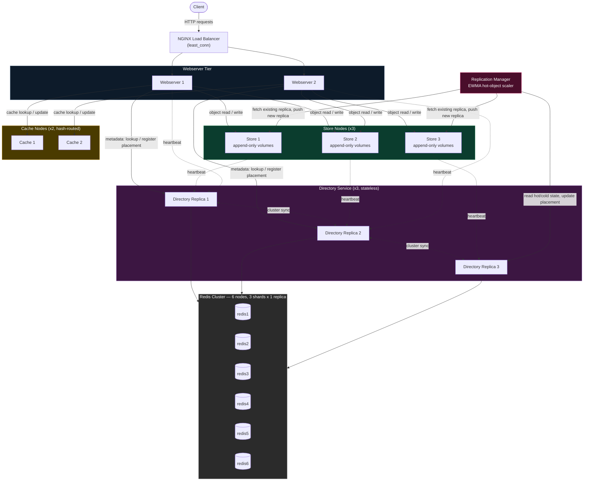
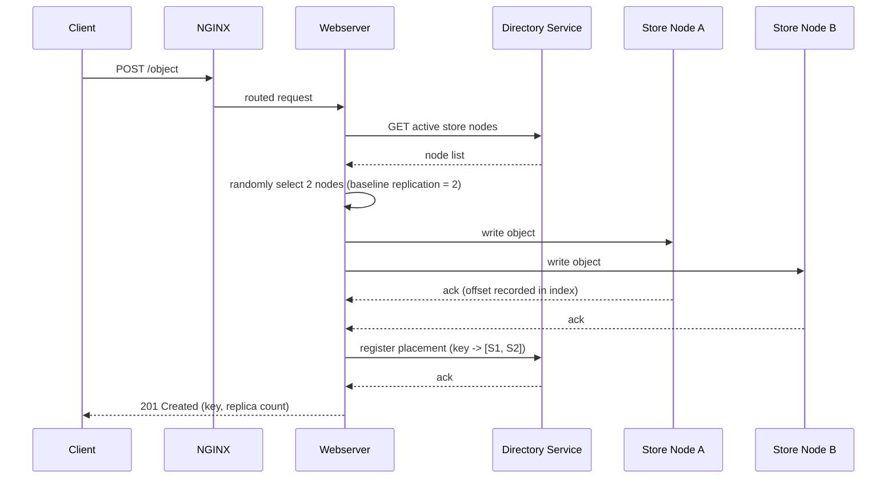
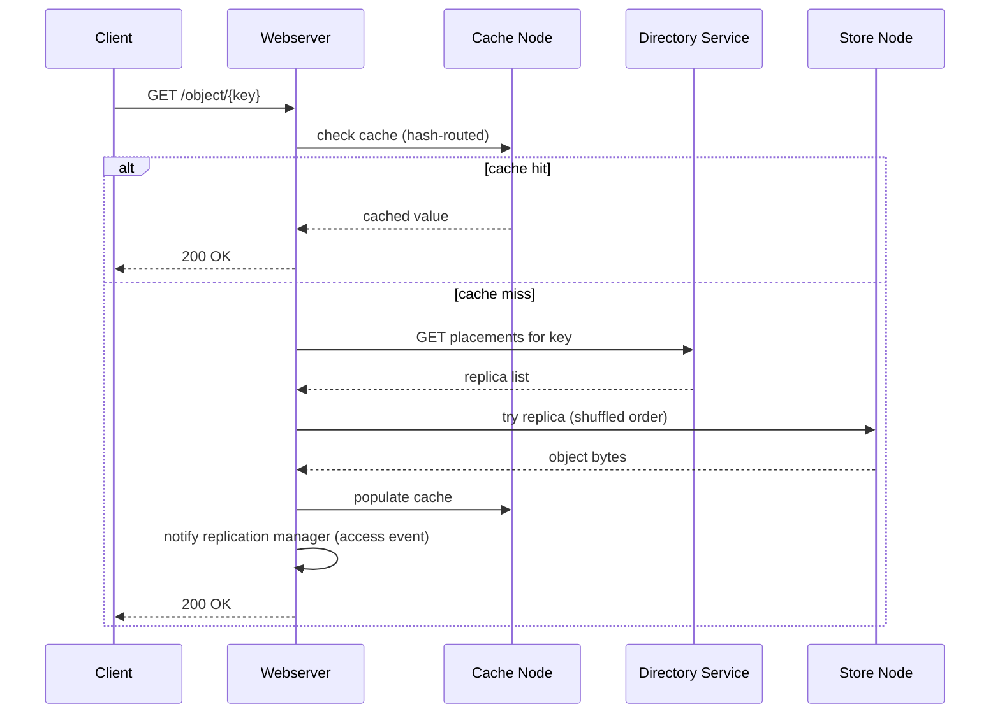
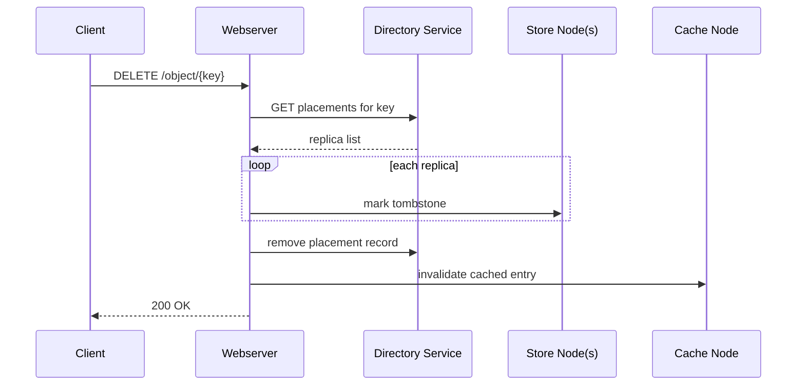
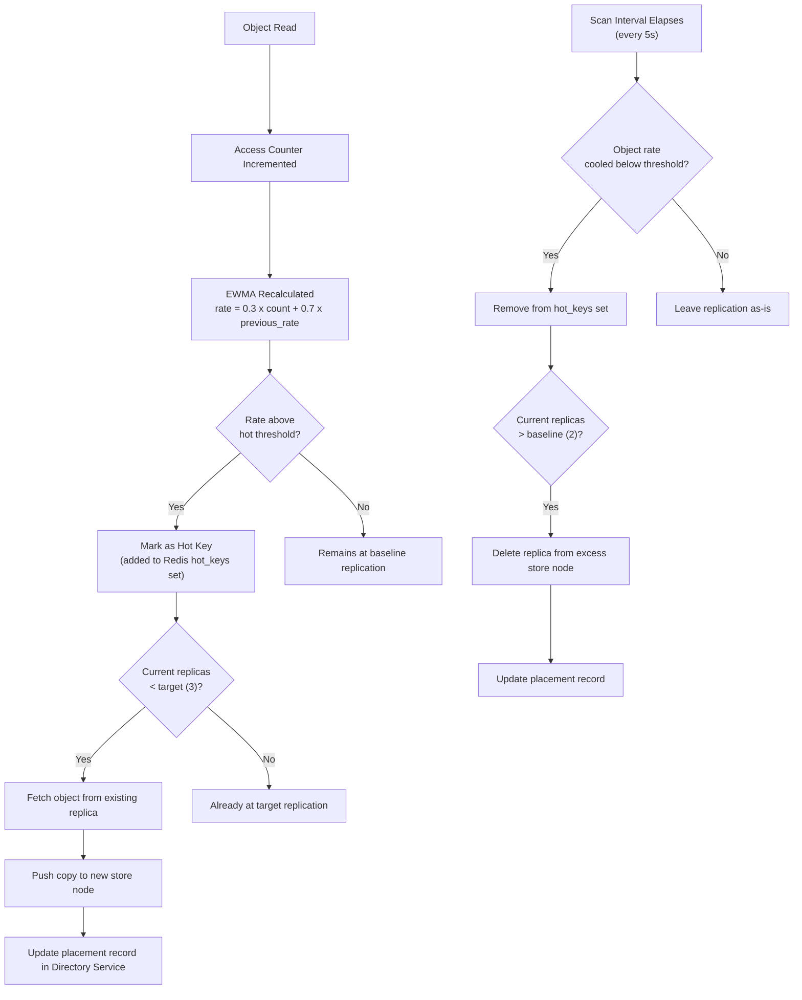
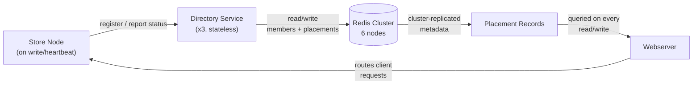

<div align="center">

# Haystack-Inspired Distributed Object Store
### Access-Pattern-Driven Replication over a Redis Cluster–Backed Metadata Layer

A multi-service object storage system that implements the core mechanics of Facebook's Haystack architecture — append-only volume storage, a directory service for object placement, and a distributed cache tier — extended with an original replication controller that scales replica count per object based on measured read frequency instead of a fixed factor.


-DC382D?logo=redis&logoColor=white)


</div>

---

## Overview

Storing a very large number of small objects reliably is a different problem than storing a few large ones. A conventional filesystem spends more metadata overhead (inodes, directory entries) per object than the object itself often needs, and a single database quickly becomes the bottleneck for both metadata lookups and the write path. Facebook's 2010 Haystack paper solved this for photo storage by collapsing many small objects into large append-only volume files with an in-memory offset index, so a read becomes one disk seek instead of several.

This project implements that core idea as a set of independently deployable services rather than a single binary: a **directory service** that tracks which nodes hold which objects, **store nodes** that own the append-only volumes, a **cache tier** in front of them, and a **replication manager** that changes how many copies of an object exist based on how often it's actually read. The interesting engineering problem this project takes on isn't storing bytes — it's coordinating placement, replication, and cache invalidation across independent processes without a single point of coordination becoming a bottleneck.

---

## Key Highlights

- 🗄️ **Real append-only storage engine** — volume files, an offset/size index, tombstone deletes, and automatic background compaction (not a wrapper around a database or filesystem library)
- 📈 **Access-pattern-driven replication** — an EWMA-based access tracker promotes frequently-read objects from 2 to 3 replicas and demotes cooling ones back down, migrating data automatically
- 🧭 **Redis Cluster as the actual metadata backbone** — 3 stateless directory-service replicas read/write a genuine 6-node Redis Cluster (3 shards × 1 replica each), rather than a single Redis instance standing in for "distributed"
- 🔁 **Consistent hashing for cache routing** — SHA-256 hash ring with 50 virtual nodes per physical cache node, minimizing cache-key churn as nodes join or leave
- 🐳 **11-service Docker Compose topology** — load balancer, 2 webserver replicas, 3 directory replicas, 3 store nodes, 2 cache nodes, 1 replication manager, and a 6-node Redis Cluster, all independently containerized

---

## Architecture



## Features

**Append-only storage engine** — Objects are appended to volume files rather than stored one-per-file, avoiding per-object filesystem overhead. An offset/size index (`index.json`) makes reads a single seek instead of a directory lookup.

**Directory service with delegated consistency** — Tracks node membership and object placement via `/join` and `/heartbeat`. All 3 replicas are stateless and operate directly on Redis Cluster — no custom consensus layer reimplements what Redis Cluster already solves.

**Distributed cache with consistent-hash routing** — A SHA-256 hash ring (50 virtual nodes/physical node) assigns cache ownership per key, so node churn reshuffles only a small fraction of keys instead of invalidating the whole cache.

**EWMA-driven dynamic replication** — Access rate per object is tracked as an exponential moving average (`rate = 0.3 × count + 0.7 × previous_rate`). Hot objects are promoted from 2 to 3 replicas; cooling ones are scaled back down. Replication cost tracks real demand instead of a flat factor.

**Background compaction** — Deletes are tombstones, not in-place rewrites, keeping the write/delete path fast. A background thread reclaims space every 60 seconds per store node.

**Load-balanced webserver tier** — NGINX (`least_conn`) distributes traffic across 2 webserver replicas with no client-visible coordination.

---

## Distributed Systems Concepts Demonstrated

| Concept | Where it shows up |
|---|---|
| **Distributed storage** | Append-only volumes spread across 3 independent store nodes |
| **Metadata service** | Directory service, backed by Redis Cluster |
| **Service discovery** | `/join` + `/heartbeat` node registration protocol |
| **Consistent hashing** | Cache-node routing (SHA-256 hash ring, 50 virtual nodes/node) |
| **Replication** | Access-pattern-driven replica scaling (2 ↔ 3) |
| **Fault tolerance** | Replica fallback on read, directory replica fallback, heartbeat-based liveness |
| **Background compaction** | Periodic volume rewrite to reclaim tombstoned space |
| **Heartbeats** | Store/webserver nodes report liveness to the directory service |
| **Horizontal scaling** | Every tier (webserver, directory, store, cache) runs multiple replicas behind discovery, not a fixed address |
| **Distributed cache** | Hash-routed cache tier, independent of the store tier |
| **High availability** | No single-instance service on the critical read/write path |
| **Load balancing** | NGINX `least_conn` across webserver replicas |

---

## Technology Stack

| Layer | Technology | Purpose |
|---|---|---|
| Load Balancer | NGINX (`least_conn`) | Distributes client traffic across webserver replicas |
| API Layer | FastAPI + Uvicorn (Python 3.11) | All 5 services (webserver, directory, store, cache, replication-manager) |
| Metadata Store | Redis Cluster (6 nodes, 3 shards × 1 replica) | Node membership + object placement records |
| Inter-service Communication | HTTP (via `requests`) | All service-to-service calls; no message queue or RPC framework |
| Storage Engine | Custom append-only volume engine (Python) | Object bytes on disk, per store node |
| Deployment | Docker Compose | 11-service local orchestration |
| Consistent Hashing | Custom SHA-256 hash ring implementation | Cache-node selection |

---

**Component summary:**

| Component | Role |
|---|---|
| **NGINX** | Entry point; load-balances across webserver replicas |
| **Webserver** | Client-facing API; orchestrates directory lookups, cache checks, and store node reads/writes |
| **Directory Service** | Tracks node membership and object placement; stateless, backed entirely by Redis Cluster |
| **Redis Cluster** | Source of truth for metadata; the only component in the metadata path that actually replicates itself |
| **Store Nodes** | Own the append-only volumes; handle reads, writes, deletes, and compaction |
| **Cache Nodes** | Hash-routed read-through cache in front of store nodes |
| **Replication Manager** | Background service that scales replica count per object based on access frequency |

---

## Request Lifecycle

### Upload Flow



### Download Flow



### Deletion Flow



---

## Dynamic Replication Workflow



---

## Metadata Flow



---

## Component Deep Dive

### Directory Service (`directory-service/app/`)
**Purpose:** Track which nodes are alive and which store nodes hold which objects.
**Responsibilities:** Node registration (`/join`), liveness (`/heartbeat`), placement CRUD (`/placements/{key}`).
**Internal logic:** Entirely stateless — every replica reads/writes the same Redis Cluster hashes (`directory:members`, `directory:placements`). Heartbeat timeouts are filtered at read time.
**Key source files:** `main.py`, `router.py`, `state.py`.
**Design decision:** No custom replication protocol was built for this service — Redis Cluster's own replication is trusted as the consistency mechanism, avoiding a second, redundant consensus layer.

### Store Service (`store-service/app/`)
**Purpose:** Own and serve the actual object bytes.
**Responsibilities:** Append-only writes, offset-indexed reads, tombstone deletes, background compaction, node registration/heartbeat to the directory service.
**Internal logic:** `engine.py` manages volume files and a persisted offset/size index (`index.json`); a background thread runs compaction every 60 seconds to rewrite volumes and reclaim tombstoned space.
**Key source files:** `engine.py`, `cluster.py`, `router.py`, `state.py`.
**Design decision:** Multiple volumes per node are supported by the engine, but the current routing logic writes every object to a single active volume — a scoped implementation choice, noted explicitly under Future Improvements.

### Cache Service (`cache-service/app/`)
**Purpose:** Reduce store-node read load for frequently accessed objects.
**Responsibilities:** `get`/`set`/`invalidate`, ownership validation via consistent hashing.
**Internal logic:** `hash_ring.py` implements a SHA-256 ring with 50 virtual nodes per physical cache node; writes are rejected (403) if the requesting webserver picked the wrong cache node for a key, keeping ownership consistent.
**Key source files:** `hash_ring.py`, `cluster.py`, `router.py`, `state.py`.

### Replication Manager (`replication-manager/app/`)
**Purpose:** Adjust replica count per object based on real access patterns instead of a fixed factor.
**Responsibilities:** EWMA access-rate tracking, hot/cold key classification, replica migration (push to scale up, delete to scale down), placement updates.
**Internal logic:** `replicator.py` runs a scan loop every 5 seconds, computing `rate = 0.3 × count + 0.7 × previous_rate` per key and comparing against a threshold to decide target replication (2 baseline, 3 if hot).
**Key source files:** `replicator.py`, `router.py`, `state.py`.

### Webserver (`webserver/app/`)
**Purpose:** Client-facing API gateway; the only component clients talk to directly (via NGINX).
**Responsibilities:** Object key generation, replica selection at write time, cache-check-then-store-fallback at read time, deletion fan-out, access-event reporting to the replication manager.
**Internal logic:** Object keys are server-generated (`uuid4`) rather than client-specified. Initial store-node placement uses random sampling (`random.sample`) rather than consistent hashing — consistent hashing in this codebase is used specifically for cache-node routing, not store placement.
**Key source files:** `hash_ring.py`, `cluster.py`, `router.py`, `state.py`, `static/index.html` (minimal upload/list UI).

---

## Storage Engine

Objects are appended to a volume file as `[8-byte length prefix][raw bytes]`, with the resulting offset and size recorded in an in-memory index that's persisted to `index.json` on every write. Reads are a single seek-and-read using the indexed offset — no directory traversal, no per-object file handle. Deletes set a tombstone flag rather than physically removing data immediately, keeping the write and delete paths equally fast and simple. A background thread compacts each volume every 60 seconds, rewriting it without tombstoned entries to reclaim space. There is currently no checksum or magic-number validation on stored records — a corrupted byte on disk would not be detected at read time.

---

## Replication

Every object starts at a baseline replication factor of 2, chosen at write time by random sampling across active store nodes. The replication manager independently tracks how often each object is read and computes an exponential moving average of that access rate. Objects whose rate crosses a threshold are promoted to a third replica — the manager fetches the current bytes from an existing replica and pushes them to a newly selected store node, then updates the placement record. Objects that cool back down have their extra replica deleted and the placement record updated accordingly. This means replication cost tracks actual read demand: a rarely accessed object doesn't pay for a third copy it doesn't need, while a hot object gets additional read capacity without any manual intervention.

---

## Consistent Hashing

Cache-node selection uses a SHA-256-based hash ring with 50 virtual nodes per physical cache node. This exists specifically to bound the amount of cache invalidation/churn that happens when a cache node joins or leaves — without virtual nodes, adding or removing a single physical node can remap a large, unpredictable fraction of keys; with enough virtual nodes spread around the ring, only a proportional slice of keys move. Note that consistent hashing in this codebase governs **cache routing only** — initial store-node placement for object writes uses random sampling, with the replication manager handling any subsequent rebalancing.

---

## Metadata Management

All node membership and object placement metadata lives in Redis Cluster (`directory:members`, `directory:placements` hashes), written and read directly by all 3 directory-service replicas. There is no separate metadata database and no custom replication protocol for this data — Redis Cluster's own sharding and per-shard replica handle that, which is a deliberate choice to avoid re-solving a problem Redis Cluster already solves well.

---

## Fault Tolerance

Reads fall back across all known replicas for a key in randomized order before failing, so a single down store node doesn't fail a read as long as at least one other replica is reachable. Directory lookups fall back across all 3 directory replicas. A cache miss or cache-service error is treated transparently as a miss, falling through to the store tier rather than failing the request. Node liveness is tracked via periodic heartbeats to the directory service, with stale entries filtered out of active-node queries. There is currently no retry/backoff policy beyond a single pass across known replicas, and no automatic re-replication trigger tied specifically to node failure (only to access-pattern-driven scaling).

---

## Scalability

Every tier — webserver, directory service, store nodes, cache nodes — is designed to run multiple replicas discovered dynamically rather than addressed by fixed configuration. Adding a new store node means it registers itself via `/join` and starts receiving heartbeats and (eventually) placement decisions; no other service needs a config change or restart to become aware of it. The same is true for adding webserver or cache replicas behind NGINX and the hash ring, respectively.

---

## Performance Optimizations

| Optimization | Effect |
|---|---|
| Append-only writes | Write throughput independent of existing object count on a node |
| Offset-indexed reads | Single seek per read, no directory traversal |
| In-memory read cache (store nodes) | Avoids repeated disk reads for locally hot objects |
| Distributed cache tier | Avoids store-node reads entirely for cache hits |
| Access-pattern-driven replication | Extra replicas only exist where read demand justifies them |
| Background compaction | Space reclamation happens off the write/read hot path |

---

## Engineering Decisions

| Decision | Alternative considered | Why this approach | Tradeoff accepted |
|---|---|---|---|
| Redis Cluster as the sole metadata consistency mechanism | Custom Raft/Paxos-based directory replication | Avoids reimplementing consensus for a problem Redis Cluster already solves | Directory service correctness is only as strong as the underlying Redis Cluster configuration |
| Random placement for initial store replicas | Consistent hashing for store placement | Store rebalancing is already handled by the replication manager, so initial placement doesn't need hash-stability guarantees | Initial placement isn't deterministic from the key alone |
| Consistent hashing for cache routing only | Consistent hashing everywhere | Cache-node churn is the specific problem consistent hashing solves well; store placement has a different rebalancing story | Two different placement strategies to reason about instead of one |
| Tombstone deletes + periodic compaction | Immediate in-place file rewrite on delete | Keeps the delete path O(1) instead of O(volume size) | Deleted space isn't reclaimed until the next compaction cycle |
| Server-generated object keys | Client-specified keys | Removes key-collision handling entirely | No support for client-defined addressing schemes |

---

## Folder Structure

```
Haystack-Object-Storage-with-Dynamic-Replication/
├── directory-service/
│   └── app/
│       ├── main.py
│       ├── router.py
│       └── state.py
├── store-service/
│   └── app/
│       ├── engine.py         # volumes, index, compaction, in-memory cache
│       ├── cluster.py        # registration + heartbeat
│       ├── router.py
│       └── state.py
├── cache-service/
│   └── app/
│       ├── hash_ring.py
│       ├── cluster.py
│       ├── router.py
│       └── state.py
├── replication-manager/
│   └── app/
│       ├── replicator.py     # EWMA access tracking + replica scaling
│       ├── router.py
│       └── state.py
├── webserver/
│   └── app/
│       ├── hash_ring.py
│       ├── cluster.py
│       ├── router.py
│       ├── state.py
│       └── static/index.html
├── docker-compose.yml
├── nginx.conf
├── redis-init.sh              # Redis Cluster bootstrap with health-check polling
└── docker_nuke.sh             # local environment reset script
```

---

## Docker Deployment

The full system is defined as an 11-service Docker Compose topology: a 6-node Redis Cluster (3 shards × 1 replica each), 3 directory-service replicas, 3 store nodes, 2 cache nodes, 1 replication manager, 2 webserver replicas, and an NGINX load balancer in front of them. `redis-init.sh` runs as part of startup and polls `cluster_state:ok` with a bounded retry loop before dependent services come up, rather than relying on a fixed sleep — avoiding the common startup-ordering race in multi-container Redis Cluster setups.

```bash
git clone <repository-url>
cd Haystack-Object-Storage-with-Dynamic-Replication
docker-compose up --build
```

The web UI is available at `http://localhost` once all services report healthy.

```bash
docker-compose down     # stop and remove containers
./docker_nuke.sh        # full local Docker environment reset (destructive)
```

> **Known limitation:** `cache-service` and `replication-manager` currently point `REDIS_HOST` at `localhost` in `docker-compose.yml`, which resolves to each container's own loopback rather than a reachable Redis instance. In practice this means cache reads/writes fail closed (the webserver treats it as a cache miss and falls through to store nodes transparently, so correctness isn't affected) and the replication manager's background scaling loop does not currently run to completion. The fix is a one-line change — pointing `REDIS_HOST` at a reachable Redis node — not a code change to `replicator.py` or the cache service itself.

---

## API Documentation

### Webserver (client-facing, via NGINX on port 80)

| Method | Endpoint | Description |
|---|---|---|
| `POST` | `/object` | Upload a new object; key is generated server-side |
| `GET` | `/object/{key}` | Retrieve an object (cache-checked first) |
| `DELETE` | `/object/{key}` | Delete an object from all replicas and invalidate cache |

### Directory Service

| Method | Endpoint | Description |
|---|---|---|
| `POST` | `/join` | Register a node (store/webserver) as active |
| `POST` | `/heartbeat` | Report liveness for a registered node |
| `GET` | `/nodes` | List currently active nodes |
| `GET` | `/placements/{key}` | Get the replica list for an object key |
| `POST` | `/placements/{key}` | Register/update a placement record |
| `DELETE` | `/placements/{key}` | Remove a placement record |

### Store Service (internal)

| Method | Endpoint | Description |
|---|---|---|
| `GET` | `/object/{key}` | Read an object from this node's volumes |
| `POST` | `/object/{key}` | Write an object to this node |
| `DELETE` | `/object/{key}` | Tombstone an object on this node |
| `POST` | `/replicate` | Receive a replicated copy pushed by another component |
| `GET` | `/list_keys` | List keys currently held by this node |

### Cache Service (internal)

| Method | Endpoint | Description |
|---|---|---|
| `GET` | `/get/{key}` | Retrieve a cached value |
| `POST` | `/set/{key}` | Store a value in cache |
| `POST` | `/invalidate/{key}` | Remove a value from cache |

### Replication Manager (internal)

| Method | Endpoint | Description |
|---|---|---|
| `POST` | `/access/{key}` | Record a read event for EWMA tracking |
| `GET` | `/status` | Current per-key access rates and hot/cold state |

---

## Future Improvements

- **Erasure coding** for storage efficiency at higher replication scale, instead of full-copy replication only
- **Object versioning with real conflict resolution** — the API currently exposes a `version` field that isn't enforced against prior writes
- **Authentication/authorization** — no service or client-facing endpoint currently requires credentials
- **Prometheus + Grafana** for request latency, replication events, and compaction metrics
- **Multi-region replication** for geographic fault isolation
- **Consensus-based directory metadata** (e.g., Raft) as an alternative to delegating entirely to Redis Cluster, if metadata consistency requirements ever exceed what Redis Cluster provides
- **Checksums on stored records** to detect corruption at read time
- **Multi-volume write distribution** at the store-node API layer (the storage engine already supports multiple volumes; the current routing logic doesn't yet distribute writes across them)

---

## Skills Demonstrated

`Distributed Systems` · `System Design` · `Storage Engine Design` · `Redis Cluster` · `FastAPI` · `Docker & Docker Compose` · `NGINX Load Balancing` · `Microservice Architecture` · `REST API Design` · `Fault Tolerance` · `Horizontal Scalability` · `Replication Algorithms` · `Distributed Caching` · `Object Storage` · `Metadata Management` · `Consistent Hashing` · `Service Discovery` · `Cloud-Native Infrastructure`

---
